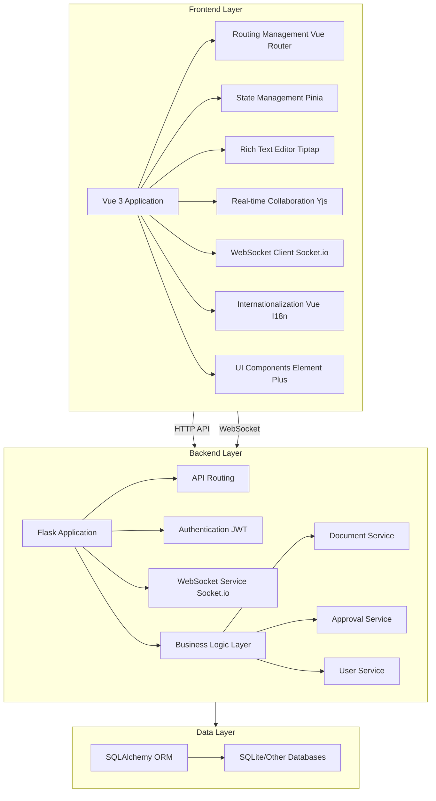
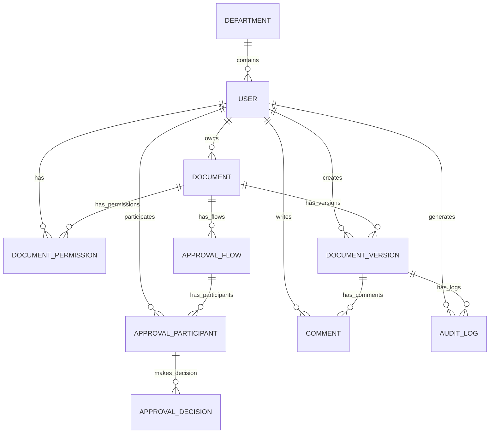

# EDMS Electronic Document Management System - Technical Documentation

## 1. System Overview

EDMS (Electronic Document Management System) is a modern electronic document management system designed to provide efficient document creation, editing, collaboration, approval, and management functions. The system adopts a front-end and back-end separation architecture, supports multi-language internationalization, and provides a complete document lifecycle management solution for enterprises and organizations.

### 1.1 Core Features

- **Document Management**: Create, edit, version control, permission management
- **Collaborative Editing**: Real-time multi-person collaborative editing, support for cursor synchronization
- **Approval Workflow**: Support for serial and parallel approval processes
- **Master Data Management**: Support for importing master data such as departments, positions, and personnel
- **Comment System**: Document comments and feedback
- **Permission Control**: Fine-grained document permission management
- **Internationalization Support**: Chinese, English, and Russian interfaces

### 1.2 Technology Stack

| Category | Technology/Framework | Version | Purpose |
| --- | --- | --- | --- |
| Frontend | Vue 3 | ^3.5.13 | Frontend framework |
| Frontend | TypeScript | ~5.7.2 | Type system |
| Frontend | Element Plus | ^2.9.1 | UI component library |
| Frontend | Tiptap | ^2.11.5 | Rich text editor |
| Frontend | Yjs | ^13.6.23 | Real-time collaboration |
| Frontend | Socket.io | ^4.8.1 | WebSocket communication |
| Frontend | Vue Router | ^4.5.0 | Routing management |
| Frontend | Pinia | ^2.3.0 | State management |
| Frontend | Vue I18n | ^9.14.2 | Internationalization |
| Backend | Flask | - | Backend framework |
| Backend | SQLAlchemy | - | ORM |
| Backend | JWT | - | Authentication |
| Backend | Socket.io | - | WebSocket service |
| Database | SQLite | - | Default database (supports other databases) |
| Deployment | Docker | - | Containerized deployment |

## 2. Software Architecture

### 2.1 System Architecture Diagram



### 2.2 Architecture Description

- **Frontend Layer**: Built based on Vue 3 + TypeScript, using Element Plus as the UI component library, Tiptap as the rich text editor, Yjs for real-time collaboration, and Socket.io for WebSocket communication.
- **Backend Layer**: Based on the Flask framework, providing RESTful API and WebSocket services, implementing core business logic such as document management, approval processes, and user management.
- **Data Layer**: Using SQLAlchemy as ORM, defaulting to SQLite database, supporting other relational databases.

The system adopts a front-end and back-end separation architecture, communicating through API and WebSocket, implementing core functions such as real-time collaborative editing and approval workflow.

## 3. Database Structure

### 3.1 Database Table Relationship Diagram



### 3.2 Database Table Structure Description

#### 3.2.1 Core Tables

**departments (Department Table)**

| Field Name | Data Type | Constraints | Description |
| --- | --- | --- | --- |
| id | Integer | PRIMARY KEY | Department ID |
| code | String(64) | UNIQUE, NOT NULL, INDEX | Department Code |
| name | String(256) | NOT NULL | Department Name |

**positions (Position Table)**

| Field Name | Data Type | Constraints | Description |
| --- | --- | --- | --- |
| id | Integer | PRIMARY KEY | Position ID |
| short_name | String(128) | UNIQUE, NOT NULL, INDEX | Position Short Name |
| full_name | String(256) | NOT NULL | Position Full Name |

**users (User Table)**

| Field Name | Data Type | Constraints | Description |
| --- | --- | --- | --- |
| id | Integer | PRIMARY KEY | User ID |
| employee_no | String(64) | UNIQUE, NOT NULL, INDEX | Employee Number |
| last_name | String(128) | NOT NULL | Last Name |
| first_name | String(128) | NOT NULL | First Name |
| patronymic | String(128) | DEFAULT "" | Patronymic |
| birth_date | Date | NULL | Birth Date |
| gender | String(32) | DEFAULT "" | Gender |
| login_name | String(128) | UNIQUE, NOT NULL, INDEX | Login Name |
| department_id | Integer | FOREIGN KEY(departments.id) | Department ID |
| position_short | String(128) | DEFAULT "" | Position Short Name |
| manager_employee_no | String(64) | DEFAULT "" | Manager Employee Number |
| is_manager | Boolean | DEFAULT False | Is Manager |

#### 3.2.2 Document-Related Tables

**documents (Document Table)**

| Field Name | Data Type | Constraints | Description |
| --- | --- | --- | --- |
| id | Integer | PRIMARY KEY | Document ID |
| owner_id | Integer | FOREIGN KEY(users.id), NOT NULL | Owner ID |
| title | String(512) | NOT NULL, DEFAULT "Untitled" | Document Title |
| status | String(32) | NOT NULL, DEFAULT "draft" | Document Status (draft, in_approval, approved, rejected) |
| current_version_id | Integer | FOREIGN KEY(document_versions.id) | Current Version ID |
| page_settings_json | Text | NULL | Page Settings (JSON) |
| created_at | DateTime | DEFAULT utcnow | Creation Time |
| updated_at | DateTime | DEFAULT utcnow, onupdate=utcnow | Update Time |

**document_versions (Document Version Table)**

| Field Name | Data Type | Constraints | Description |
| --- | --- | --- | --- |
| id | Integer | PRIMARY KEY | Version ID |
| document_id | Integer | FOREIGN KEY(documents.id), NOT NULL | Document ID |
| version_no | Integer | NOT NULL, DEFAULT 1 | Version Number |
| content_json | Text | NULL | Document Content (JSON) |
| yjs_state | LargeBinary | NULL | Yjs State |
| created_by_id | Integer | FOREIGN KEY(users.id) | Creator ID |
| parent_version_id | Integer | FOREIGN KEY(document_versions.id) | Parent Version ID |
| created_at | DateTime | DEFAULT utcnow | Creation Time |

**document_permissions (Document Permission Table)**

| Field Name | Data Type | Constraints | Description |
| --- | --- | --- | --- |
| id | Integer | PRIMARY KEY | Permission ID |
| document_id | Integer | FOREIGN KEY(documents.id), NOT NULL | Document ID |
| user_id | Integer | FOREIGN KEY(users.id), NOT NULL | User ID |
| role | String(32) | NOT NULL | Role (view, edit, comment) |

#### 3.2.3 Approval-Related Tables

**approval_flows (Approval Flow Table)**

| Field Name | Data Type | Constraints | Description |
| --- | --- | --- | --- |
| id | Integer | PRIMARY KEY | Flow ID |
| document_id | Integer | FOREIGN KEY(documents.id), NOT NULL | Document ID |
| flow_type | String(32) | NOT NULL | Flow Type (parallel, sequential) |
| status | String(32) | NOT NULL, DEFAULT "active" | Flow Status (active, completed, rejected) |
| current_order | Integer | DEFAULT 1 | Current Step Order |
| created_at | DateTime | DEFAULT utcnow | Creation Time |

**approval_participants (Approval Participant Table)**

| Field Name | Data Type | Constraints | Description |
| --- | --- | --- | --- |
| id | Integer | PRIMARY KEY | Participant ID |
| flow_id | Integer | FOREIGN KEY(approval_flows.id), NOT NULL | Flow ID |
| user_id | Integer | FOREIGN KEY(users.id), NOT NULL | User ID |
| step_order | Integer | NOT NULL, DEFAULT 1 | Step Order |

**approval_decisions (Approval Decision Table)**

| Field Name | Data Type | Constraints | Description |
| --- | --- | --- | --- |
| id | Integer | PRIMARY KEY | Decision ID |
| participant_id | Integer | FOREIGN KEY(approval_participants.id), UNIQUE, NOT NULL | Participant ID |
| decision | String(32) | NOT NULL | Decision (approve, reject) |
| reason | Text | NULL | Decision Reason |
| decided_at | DateTime | DEFAULT utcnow | Decision Time |

#### 3.2.4 Other Tables

**comments (Comment Table)**

| Field Name | Data Type | Constraints | Description |
| --- | --- | --- | --- |
| id | Integer | PRIMARY KEY | Comment ID |
| document_version_id | Integer | FOREIGN KEY(document_versions.id), NOT NULL | Document Version ID |
| user_id | Integer | FOREIGN KEY(users.id), NOT NULL | User ID |
| content | Text | NOT NULL | Comment Content |
| created_at | DateTime | DEFAULT utcnow | Creation Time |

**audit_logs (Audit Log Table)**

| Field Name | Data Type | Constraints | Description |
| --- | --- | --- | --- |
| id | Integer | PRIMARY KEY | Log ID |
| document_version_id | Integer | FOREIGN KEY(document_versions.id) | Document Version ID |
| user_id | Integer | FOREIGN KEY(users.id) | User ID |
| summary | String(512) | NOT NULL | Log Summary |
| payload_json | Text | NULL | Log Payload (JSON) |
| created_at | DateTime | DEFAULT utcnow | Creation Time |

## 4. Frontend Architecture and Function Modules

### 4.1 Frontend Directory Structure

```
frontend/
├── public/              # Static resources
├── src/
│   ├── api/             # API client
│   ├── components/      # Common components
│   ├── composables/     # Compositional functions
│   ├── i18n/            # Internationalization configuration
│   ├── layouts/         # Layout components
│   ├── locales/         # Language files
│   ├── router/          # Routing configuration
│   ├── stores/          # State management
│   ├── utils/           # Utility functions
│   ├── views/           # Page views
│   ├── App.vue          # Application root component
│   └── main.ts          # Application entry
├── package.json         # Project configuration
└── vite.config.ts       # Vite configuration
```

### 4.2 Frontend Architecture Description

- **Component-Based Design**: Based on Vue 3's component-based architecture, splitting UI into reusable components.
- **State Management**: Using Pinia for state management, managing user authentication, document status, etc.
- **Routing Management**: Using Vue Router for page routing, supporting permission control.
- **Internationalization**: Using Vue I18n for Chinese and English bilingual support.
- **Real-time Collaboration**: Using Yjs and Socket.io for real-time document collaborative editing.
- **Rich Text Editing**: Using Tiptap rich text editor, supporting various editing functions.

### 4.3 Main Function Modules

#### 4.3.1 Authentication Module

- **Login Page**: User login, supporting language switching.
- **Permission Control**: JWT-based authentication, route guard control for access permissions.

#### 4.3.2 Document Management Module

- **Library Page**: Display personal and shared documents, supporting status filtering.
- **Document Editor**: Tiptap-based rich text editor, supporting real-time collaboration.
- **Document Version Management**: View and compare document version history.
- **Document Permission Management**: Set document access permissions, supporting different roles (view, edit, comment).

#### 4.3.3 Approval Workflow Module

- **Approval Flow Configuration**: Create serial or parallel approval flows, add approval participants.
- **Approval Processing**: Approvers view documents and make approval decisions (approve/reject).
- **Approval Status Tracking**: View the current status and historical records of approval flows.

#### 4.3.4 Master Data Management Module

- **Admin Page**: Upload and import master data (departments, positions, personnel).
- **Data Validation**: Validate the integrity and correctness of imported data.

#### 4.3.5 Other Modules

- **Inbox**: View documents requiring approval.
- **Dashboard**: Display system statistics and recent activities.
- **Personal Center**: View personal information and related documents.

### 4.4 Frontend Technical Highlights

1. **Real-time Collaborative Editing**: Using Yjs to implement conflict-free real-time collaborative editing, supporting multiple people editing documents simultaneously.
2. **Responsive Design**: Using Element Plus's responsive components to adapt to different screen sizes.
3. **Internationalization Support**: Built-in Chinese and English bilingual support, easily expandable to other languages.
4. **Modular Architecture**: Clear directory structure and module division, easy to maintain and expand.
5. **Type Safety**: Using TypeScript to provide type safety, reducing runtime errors.

## 5. Backend Architecture and Function Modules

### 5.1 Backend Directory Structure

```
backend/
├── app/
│   ├── api/             # API routing
│   ├── models/          # Data models
│   ├── services/        # Business logic
│   ├── sockets/         # WebSocket handling
│   ├── static/          # Static resources
│   ├── utils/           # Utility functions
│   ├── __init__.py      # Application initialization
│   ├── config.py        # Configuration file
│   └── extensions.py    # Extension initialization
├── tests/               # Test files
├── requirements.txt     # Dependency file
└── wsgi.py              # Application entry
```

### 5.2 Backend Architecture Description

- **Layered Architecture**: Adopting a classic three-tier architecture, including API layer, service layer, and data access layer.
- **RESTful API**: Using Flask-RESTful to implement RESTful API interfaces.
- **WebSocket Service**: Using Flask-SocketIO to implement real-time communication.
- **ORM**: Using SQLAlchemy as ORM, simplifying database operations.
- **Authentication**: Using JWT for identity authentication and authorization.

### 5.3 Main Function Modules

#### 5.3.1 Authentication Module

- **User Login**: Verify user identity, generate JWT token.
- **Permission Validation**: Verify if the user has permission to access specific resources.

#### 5.3.2 Document Management Module

- **Document CRUD**: Create, read, update, delete documents.
- **Version Management**: Manage document version history, support version comparison.
- **Permission Management**: Set and manage document access permissions.
- **Real-time Collaboration**: Handle WebSocket connections, synchronize document editing status.

#### 5.3.3 Approval Workflow Module

- **Flow Management**: Create and manage approval flows.
- **Approval Processing**: Handle approval decisions, update flow status.
- **Notification**: Send approval notifications to relevant users.

#### 5.3.4 Master Data Management Module

- **Data Import**: Import master data such as departments, positions, and personnel.
- **Data Validation**: Validate the integrity and correctness of imported data.
- **Data Management**: Manage and maintain master data.

#### 5.3.5 Other Modules

- **Comment System**: Manage document comments.
- **Audit Logs**: Record system operation logs.
- **Export Service**: Export documents to other formats.

### 5.4 Core API Design

#### 5.4.1 Authentication API

- `POST /api/auth/login` - User login
- `GET /api/auth/me` - Get current user information

#### 5.4.2 Document API

- `GET /api/documents` - Get document list
- `POST /api/documents` - Create new document
- `GET /api/documents/:id` - Get document details
- `PATCH /api/documents/:id` - Update document information
- `DELETE /api/documents/:id` - Delete document
- `GET /api/documents/:id/versions` - Get document version history
- `GET /api/documents/:id/permissions` - Get document permissions
- `POST /api/documents/:id/permissions` - Set document permissions
- `DELETE /api/documents/:id/permissions/:user_id` - Delete document permissions

#### 5.4.3 Approval API

- `POST /api/approvals` - Create approval flow
- `GET /api/approvals/:id` - Get approval flow details
- `POST /api/approvals/:id/decisions` - Submit approval decision
- `GET /api/inbox` - Get user's pending approval documents

#### 5.4.4 Master Data API

- `POST /api/master-data/import` - Import master data
- `GET /api/master-data/departments` - Get department list
- `GET /api/master-data/users` - Get user list

### 5.5 Backend Technical Highlights

1. **Real-time Collaboration**: Using Socket.io and Yjs to implement real-time document collaboration, supporting multiple people editing simultaneously.
2. **Flexible Approval Flow**: Supporting serial and parallel approval flows to meet different business scenario requirements.
3. **Fine-grained Permission Control**: Role-based permission management, supporting different levels of document access permissions.
4. **Scalability**: Modular design, easy to add new functions and extend existing functions.
5. **Security**: Using JWT for identity authentication, protecting API interface security.

## 6. Input Information Interaction Algorithm Description

### 6.1 Real-time Collaborative Editing Algorithm

#### 6.1.1 Yjs Conflict Resolution Algorithm

EDMS uses the Yjs library to implement real-time collaborative editing, adopting CRDT (Conflict-free Replicated Data Type) algorithm to solve concurrent editing conflicts.

**Core Principles**:

- **Operation Transformation**: Transform user editing operations into mergeable operations to ensure final consistency
- **Vector Clock**: Use vector clock to track operation order, ensuring operation causality
- **State Synchronization**: Real-time synchronize document status through WebSocket

**Workflow**:

1. User performs editing operations in the frontend editor
2. Tiptap editor converts operations to Yjs operations
3. Yjs sends operations to backend WebSocket service
4. Backend broadcasts operations to other online users
5. Other users' Yjs instances receive operations and apply them to local documents
6. All users finally see the same document content

#### 6.1.2 Cursor Synchronization Algorithm

The system uses Tiptap's collaboration-cursor extension to implement cursor synchronization, allowing users to see other users' editing positions.

**Implementation Principles**:

- Each user's cursor position is managed as a separate state in Yjs
- Cursor position updates are broadcast in real-time through WebSocket
- The frontend displays other users' cursors in the editor based on the received cursor position information

### 6.2 Approval Workflow Algorithm

#### 6.2.1 Serial Approval Flow

**Algorithm Flow**:

1. Document creator starts approval flow, specifying approvers and their approval order
2. System notifies approvers in the specified order
3. After each approver completes approval, the system automatically notifies the next approver
4. After all approvers approve, the document status becomes "approved"
5. If any approver rejects, the flow terminates, and the document status becomes "rejected"

**State Management**:

- Use `current_order` field to track current approval step
- Only approvers of the current step can perform approval operations
- Approval decisions are stored in the `approval_decisions` table

#### 6.2.2 Parallel Approval Flow

**Algorithm Flow**:

1. Document creator starts parallel approval flow, specifying multiple approvers
2. System notifies all approvers simultaneously
3. All approvers conduct approval independently
4. After all approvers approve, the document status becomes "approved"
5. If any approver rejects, the flow terminates, and the document status becomes "rejected"

**State Management**:

- All approvers are active simultaneously
- System tracks all approvers' decision status in real-time
- The flow ends when all approvers complete their decisions or any one rejects

### 6.3 Permission Management Algorithm

**Permission Check Flow**:

1. When user requests to access a document, the system checks the user's permissions
2. Permission check order:
   - Check if the user is the document owner
   - Check if the user has explicit document permissions
   - Check document status (approved documents may be visible to all users)

**Permission Levels**:

- **View**: Can only view document content
- **Comment**: Can view and comment on documents
- **Edit**: Can view, edit, and comment on documents

### 6.4 Master Data Import Algorithm

**Import Flow**:

1. Administrator uploads Excel file
2. System validates file format and data integrity
3. System imports data in the following order:
   - Department data
   - Position data
   - Personnel data
   - Management relationship
4. After import is complete, the system updates the database and notifies the administrator of the import result

**Data Validation**:

- Check if required fields are empty
- Check if data format is correct
- Check if departments and positions exist
- Check if personnel numbers are unique

### 6.5 Document Version Management Algorithm

**Version Creation Flow**:

1. When user edits a document, the system automatically creates a new version
2. The new version inherits the content and metadata of the parent version
3. The system records the version creator and creation time
4. The document's `current_version_id` is updated to the newly created version ID

**Version Comparison Algorithm**:

- The system uses diff algorithm to compare content differences between two versions
- The frontend displays version differences in a visual way
- Users can view differences between any two versions

### 6.6 Search Algorithm

**Document Search Flow**:

1. User enters search keywords
2. System searches for matches in document titles and content
3. System sorts results based on matching degree and returns them
4. Frontend displays search results, highlighting matching keywords

**Search Optimization**:

- Use database indexes to improve search performance
- Support fuzzy search and partial matching
- Support filtering by document status, creation time, etc.