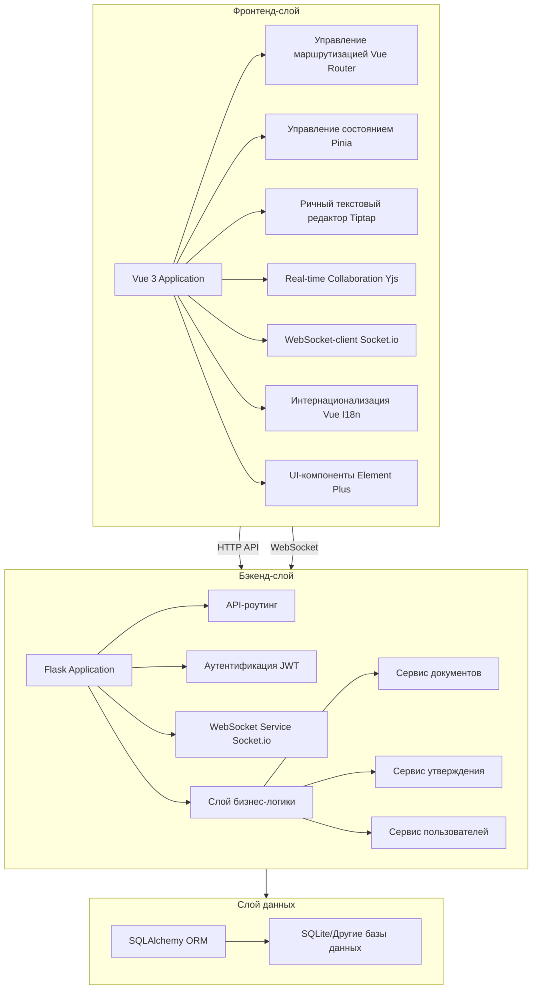
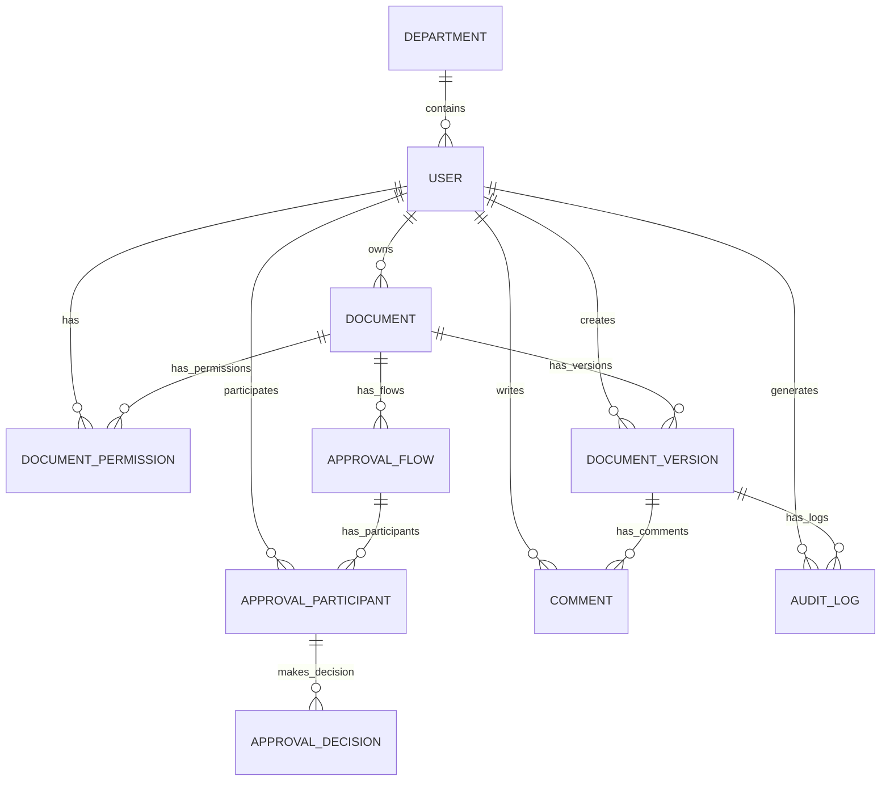

# EDMS Электронная система управления документами - Техническая документация

## 1. Обзор системы

EDMS (Electronic Document Management System) - это современная электронная система управления документами, предназначенная для обеспечения эффективных функций создания, редактирования, совместной работы, утверждения и управления документами. Система использует архитектуру с разделением фронтенда и бэкенда, поддерживает многоязычную интернационализацию и предоставляет полное решение для управления жизненным циклом документов для предприятий и организаций.

### 1.1 Основные функции

- **Управление документами**: создание, редактирование, управление версиями, управление правами доступа
- **Совместное редактирование**: Совместное редактирование нескольких пользователей в реальном времени, поддержка синхронизации курсора
- **Рабочий процесс утверждения**: поддержка последовательных и параллельных процессов утверждения
- **Управление основными данными**: поддержка импорта основных данных, таких как отделы, должности, персонал
- **Система комментариев**: комментарии и обратная связь к документам
- **Управление правами доступа**: детальное управление правами доступа к документам
- **Поддержка интернационализации**: интерфейсы на китайском, английском и русском языках

### 1.2 Технологический стек

| Категория | Технология/Фреймворк | Версия | Назначение |
| --- | --- | --- | --- |
| Фронтенд | Vue 3 | ^3.5.13 | Фронтенд-фреймворк |
| Фронтенд | TypeScript | ~5.7.2 | Система типов |
| Фронтенд | Element Plus | ^2.9.1 | Библиотека UI-компонентов |
| Фронтенд | Tiptap | ^2.11.5 | Ричный текстовый редактор |
| Фронтенд | Yjs | ^13.6.23 | Real-time collaboration |
| Фронтенд | Socket.io | ^4.8.1 | WebSocket communication |
| Фронтенд | Vue Router | ^4.5.0 | Управление маршрутизацией |
| Фронтенд | Pinia | ^2.3.0 | Управление состоянием |
| Фронтенд | Vue I18n | ^9.14.2 | Интернационализация |
| Бэкенд | Flask | - | Бэкенд-фреймворк |
| Бэкенд | SQLAlchemy | - | ORM |
| Бэкенд | JWT | - | Аутентификация |
| Бэкенд | Socket.io | - | WebSocket service |
| База данных | SQLite | - | Стандартная база данных (поддерживает другие базы данных) |
| Развертывание | Docker | - | Контейнеризованное развертывание |

## 2. Архитектура программного обеспечения

### 2.1 Диаграмма архитектуры системы



### 2.2 Описание архитектуры

- **Фронтенд-слой**: Построен на базе Vue 3 + TypeScript, использует Element Plus в качестве библиотеки UI-компонентов, Tiptap в качестве richtext редактора, Yjs для real-time collaboration, и Socket.io для WebSocket communication.
- **Бэкенд-слой**: Основан на фреймворке Flask, предоставляет RESTful API и WebSocket services, реализует основную бизнес-логику, такую как управление документами, процессы утверждения, управление пользователями и т.д.
- **Слой данных**: Использует SQLAlchemy в качестве ORM, по умолчанию использует базу данных SQLite, поддерживает другие реляционные базы данных.

Система использует архитектуру с разделением фронтенда и бэкенда, общающуюся через API и WebSocket, реализуя такие основные функции, как совместное редактирование в реальном времени и рабочий процесс утверждения.

## 3. Структура базы данных

### 3.1 Диаграмма отношений таблиц базы данных



### 3.2 Описание структуры таблиц базы данных

#### 3.2.1 Основные таблицы

**departments (Таблица отделов)**

| Название поля | Тип данных | Ограничения | Описание |
| --- | --- | --- | --- |
| id | Integer | PRIMARY KEY | ID отдела |
| code | String(64) | UNIQUE, NOT NULL, INDEX | Код отдела |
| name | String(256) | NOT NULL | Название отдела |

**positions (Таблица должностей)**

| Название поля | Тип данных | Ограничения | Описание |
| --- | --- | --- | --- |
| id | Integer | PRIMARY KEY | ID должности |
| short_name | String(128) | UNIQUE, NOT NULL, INDEX | Краткое название должности |
| full_name | String(256) | NOT NULL | Полное название должности |

**users (Таблица пользователей)**

| Название поля | Тип данных | Ограничения | Описание |
| --- | --- | --- | --- |
| id | Integer | PRIMARY KEY | ID пользователя |
| employee_no | String(64) | UNIQUE, NOT NULL, INDEX | Номер сотрудника |
| last_name | String(128) | NOT NULL | Фамилия |
| first_name | String(128) | NOT NULL | Имя |
| patronymic | String(128) | DEFAULT "" | Отчество |
| birth_date | Date | NULL | Дата рождения |
| gender | String(32) | DEFAULT "" | Пол |
| login_name | String(128) | UNIQUE, NOT NULL, INDEX | Имя для входа |
| department_id | Integer | FOREIGN KEY(departments.id) | ID отдела |
| position_short | String(128) | DEFAULT "" | Краткое название должности |
| manager_employee_no | String(64) | DEFAULT "" | Номер сотрудника-менеджера |
| is_manager | Boolean | DEFAULT False | Является ли менеджером |

#### 3.2.2 Таблицы, связанные с документами

**documents (Таблица документов)**

| Название поля | Тип данных | Ограничения | Описание |
| --- | --- | --- | --- |
| id | Integer | PRIMARY KEY | ID документа |
| owner_id | Integer | FOREIGN KEY(users.id), NOT NULL | ID владельца |
| title | String(512) | NOT NULL, DEFAULT "Untitled" | Заголовок документа |
| status | String(32) | NOT NULL, DEFAULT "draft" | Статус документа (draft, in_approval, approved, rejected) |
| current_version_id | Integer | FOREIGN KEY(document_versions.id) | ID текущей версии |
| page_settings_json | Text | NULL | Настройки страницы (JSON) |
| created_at | DateTime | DEFAULT utcnow | Время создания |
| updated_at | DateTime | DEFAULT utcnow, onupdate=utcnow | Время обновления |

**document_versions (Таблица версий документов)**

| Название поля | Тип данных | Ограничения | Описание |
| --- | --- | --- | --- |
| id | Integer | PRIMARY KEY | ID версии |
| document_id | Integer | FOREIGN KEY(documents.id), NOT NULL | ID документа |
| version_no | Integer | NOT NULL, DEFAULT 1 | Номер версии |
| content_json | Text | NULL | Содержимое документа (JSON) |
| yjs_state | LargeBinary | NULL | Состояние Yjs |
| created_by_id | Integer | FOREIGN KEY(users.id) | ID создателя |
| parent_version_id | Integer | FOREIGN KEY(document_versions.id) | ID родительской версии |
| created_at | DateTime | DEFAULT utcnow | Время создания |

**document_permissions (Таблица прав доступа к документам)**

| Название поля | Тип данных | Ограничения | Описание |
| --- | --- | --- | --- |
| id | Integer | PRIMARY KEY | ID права |
| document_id | Integer | FOREIGN KEY(documents.id), NOT NULL | ID документа |
| user_id | Integer | FOREIGN KEY(users.id), NOT NULL | ID пользователя |
| role | String(32) | NOT NULL | Роль (view, edit, comment) |

#### 3.2.3 Таблицы, связанные с утверждением

**approval_flows (Таблица процессов утверждения)**

| Название поля | Тип данных | Ограничения | Описание |
| --- | --- | --- | --- |
| id | Integer | PRIMARY KEY | ID процесса |
| document_id | Integer | FOREIGN KEY(documents.id), NOT NULL | ID документа |
| flow_type | String(32) | NOT NULL | Тип процесса (parallel, sequential) |
| status | String(32) | NOT NULL, DEFAULT "active" | Статус процесса (active, completed, rejected) |
| current_order | Integer | DEFAULT 1 | Текущий порядок шага |
| created_at | DateTime | DEFAULT utcnow | Время создания |

**approval_participants (Таблица участников утверждения)**

| Название поля | Тип данных | Ограничения | Описание |
| --- | --- | --- | --- |
| id | Integer | PRIMARY KEY | ID участника |
| flow_id | Integer | FOREIGN KEY(approval_flows.id), NOT NULL | ID процесса |
| user_id | Integer | FOREIGN KEY(users.id), NOT NULL | ID пользователя |
| step_order | Integer | NOT NULL, DEFAULT 1 | Порядок шага |

**approval_decisions (Таблица решений по утверждению)**

| Название поля | Тип данных | Ограничения | Описание |
| --- | --- | --- | --- |
| id | Integer | PRIMARY KEY | ID решения |
| participant_id | Integer | FOREIGN KEY(approval_participants.id), UNIQUE, NOT NULL | ID участника |
| decision | String(32) | NOT NULL | Решение (approve, reject) |
| reason | Text | NULL | Причина решения |
| decided_at | DateTime | DEFAULT utcnow | Время решения |

#### 3.2.4 Другие таблицы

**comments (Таблица комментариев)**

| Название поля | Тип данных | Ограничения | Описание |
| --- | --- | --- | --- |
| id | Integer | PRIMARY KEY | ID комментария |
| document_version_id | Integer | FOREIGN KEY(document_versions.id), NOT NULL | ID версии документа |
| user_id | Integer | FOREIGN KEY(users.id), NOT NULL | ID пользователя |
| content | Text | NOT NULL | Содержимое комментария |
| created_at | DateTime | DEFAULT utcnow | Время создания |

**audit_logs (Таблица аудита)**

| Название поля | Тип данных | Ограничения | Описание |
| --- | --- | --- | --- |
| id | Integer | PRIMARY KEY | ID лога |
| document_version_id | Integer | FOREIGN KEY(document_versions.id) | ID версии документа |
| user_id | Integer | FOREIGN KEY(users.id) | ID пользователя |
| summary | String(512) | NOT NULL | Сводка лога |
| payload_json | Text | NULL | Полезная нагрузка лога (JSON) |
| created_at | DateTime | DEFAULT utcnow | Время создания |

## 4. Архитектура фронтенда и функциональные модули

### 4.1 Структура каталогов фронтенда

```
frontend/
├── public/              # Статические ресурсы
├── src/
│   ├── api/             # API-клиент
│   ├── components/      # Общие компоненты
│   ├── composables/     # Композиционные функции
│   ├── i18n/            # Конфигурация интернационализации
│   ├── layouts/         # Компоненты макета
│   ├── locales/         # Языковые файлы
│   ├── router/          # Конфигурация маршрутизации
│   ├── stores/          # Управление состоянием
│   ├── utils/           # Утилита-функции
│   ├── views/           # Представления страниц
│   ├── App.vue          # Корневой компонент приложения
│   └── main.ts          # Точка входа приложения
├── package.json         # Конфигурация проекта
└── vite.config.ts       # Конфигурация Vite
```

### 4.2 Описание архитектуры фронтенда

- **Компонентный дизайн**: Основан на компонентной архитектуре Vue 3, разделяющий UI на переиспользуемые компоненты.
- **Управление состоянием**: Использует Pinia для управления состоянием, управляет аутентификацией пользователя, состоянием документов и т.д.
- **Управление маршрутизацией**: Использует Vue Router для маршрутизации страниц, поддерживает контроль прав доступа.
- **Интернационализация**: Использует Vue I18n для двуязычной поддержки (китайский и английский).
- **Real-time Collaboration**: Использует Yjs и Socket.io для real-time document collaborative editing.
- **Редактирование richtext**: Использует richtext редактор Tiptap, поддерживающий различные функции редактирования.

### 4.3 Основные функциональные модули

#### 4.3.1 Модуль аутентификации

- **Страница входа**: Вход пользователя, поддержка смены языка.
- **Контроль прав доступа**: Аутентификация на основе JWT, контроль доступа через маршрутные охранники.

#### 4.3.2 Модуль управления документами

- **Страница библиотеки**: Отображение личных и общих документов, поддержка фильтрации по статусу.
- **Редактор документов**: Richtext редактор на основе Tiptap, поддерживающий real-time collaboration.
- **Управление версиями документов**: Просмотр и сравнение истории версий документов.
- **Управление правами доступа к документам**: Настройка прав доступа к документам, поддержка разных ролей (просмотр, редактирование, комментирование).

#### 4.3.3 Модуль рабочего процесса утверждения

- **Конфигурация процесса утверждения**: Создание последовательных или параллельных процессов утверждения, добавление участников утверждения.
- **Обработка утверждения**: Утвердители просматривают документы и принимают решения об утверждении (одобрить/отклонить).
- **Отслеживание статуса утверждения**: Просмотр текущего статуса и исторических записей процессов утверждения.

#### 4.3.4 Модуль управления основными данными

- **Страница администратора**: Загрузка и импорт основных данных (отделы, должности, персонал).
- **Проверка данных**: Проверка целостности и корректности импортированных данных.

#### 4.3.5 Другие модули

- **Входящие**: Просмотр документов, требующих утверждения.
- **Панель управления**: Отображение системной статистики и последней активности.
- **Личный центр**: Просмотр личной информации и связанных документов.

### 4.4 Технические особенности фронтенда

1. **Real-time Collaborative Editing**: Использует Yjs для реализации conflict-free real-time collaborative editing, поддерживающий multiple people editing documents simultaneously.
2. **Адаптивный дизайн**: Использует адаптивные компоненты Element Plus для адаптации к разным размерам экрана.
3. **Поддержка интернационализации**: Встроенная двуязычная поддержка (китайский и английский), легко расширяемая на другие языки.
4. **Модульная архитектура**: Четкая структура каталогов и разделение модулей, легко поддерживается и расширяется.
5. **Типобезопасность**: Использует TypeScript для обеспечения типобезопасности, уменьшая ошибки во время выполнения.

## 5. Архитектура бэкенда и функциональные модули

### 5.1 Структура каталогов бэкенда

```
backend/
├── app/
│   ├── api/             # API-роутинг
│   ├── models/          # Модели данных
│   ├── services/        # Бизнес-логика
│   ├── sockets/         # Обработка WebSocket
│   ├── static/          # Статические ресурсы
│   ├── utils/           # Утилита-функции
│   ├── __init__.py      # Инициализация приложения
│   ├── config.py        # Конфигурационный файл
│   └── extensions.py    # Инициализация расширений
├── tests/               # Тесты
├── requirements.txt     # Файл зависимостей
└── wsgi.py              # Точка входа приложения
```

### 5.2 Описание архитектуры бэкенда

- **Слоистая архитектура**: использует классическую трехслойную архитектуру, включая API-слой, сервисный слой и слой доступа к данным.
- **RESTful API**: Использует Flask-RESTful для реализации RESTful API-интерфейсов.
- **WebSocket Service**: Использует Flask-SocketIO для реализации real-time communication.
- **ORM**: Использует SQLAlchemy в качестве ORM, упрощая операции с базой данных.
- **Аутентификация**: Использует JWT для аутентификации и авторизации.

### 5.3 Основные функциональные модули

#### 5.3.1 Модуль аутентификации

- **Вход пользователя**: Проверка личности пользователя, генерирование JWT-токена.
- **Проверка прав доступа**: Проверка, имеет ли пользователь право доступа к определенным ресурсам.

#### 5.3.2 Модуль управления документами

- **CRUD документов**: Создание, чтение, обновление, удаление документов.
- **Управление версиями**: Управление историей версий документов, поддержка сравнения версий.
- **Управление правами доступа**: Настройка и управление правами доступа к документам.
- **Real-time Collaboration**: Обработка WebSocket-подключений, синхронизация статуса редактирования документов.

#### 5.3.3 Модуль рабочего процесса утверждения

- **Управление процессами**: Создание и управление процессами утверждения.
- **Обработка утверждения**: Обработка решений по утверждению, обновление статуса процесса.
- **Уведомления**: Отправка уведомлений об утверждении соответствующим пользователям.

#### 5.3.4 Модуль управления основными данными

- **Импорт данных**: Импорт основных данных, таких как отделы, должности, персонал.
- **Проверка данных**: Проверка целостности и корректности импортированных данных.
- **Управление данными**: Управление и поддержка основных данных.

#### 5.3.5 Другие модули

- **Система комментариев**: Управление комментариями к документам.
- **Аудит-логи**: Запись логов операций системы.
- **Сервис экспорта**: Экспорт документов в другие форматы.

### 5.4 Дизайн основных API

#### 5.4.1 API аутентификации

- `POST /api/auth/login` - Вход пользователя
- `GET /api/auth/me` - Получение информации о текущем пользователе

#### 5.4.2 API документов

- `GET /api/documents` - Получение списка документов
- `POST /api/documents` - Создание нового документа
- `GET /api/documents/:id` - Получение деталей документа
- `PATCH /api/documents/:id` - Обновление информации о документе
- `DELETE /api/documents/:id` - Удаление документа
- `GET /api/documents/:id/versions` - Получение истории версий документа
- `GET /api/documents/:id/permissions` - Получение прав доступа к документу
- `POST /api/documents/:id/permissions` - Настройка прав доступа к документу
- `DELETE /api/documents/:id/permissions/:user_id` - Удаление прав доступа к документу

#### 5.4.3 API утверждения

- `POST /api/approvals` - Создание процесса утверждения
- `GET /api/approvals/:id` - Получение деталей процесса утверждения
- `POST /api/approvals/:id/decisions` - Отправка решения по утверждению
- `GET /api/inbox` - Получение документов, требующих утверждения пользователем

#### 5.4.4 API основных данных

- `POST /api/master-data/import` - Импорт основных данных
- `GET /api/master-data/departments` - Получение списка отделов
- `GET /api/master-data/users` - Получение списка пользователей

### 5.5 Технические особенности бэкенда

1. **Real-time Collaboration**: Использует Socket.io и Yjs для реализации real-time document collaboration, supporting multiple people editing simultaneously.
2. **Гибкий процесс утверждения**: Поддержка последовательных и параллельных процессов утверждения для удовлетворения требований разных бизнес-сценариев.
3. **Детальное управление правами доступа**: Роль-ориентированное управление правами, поддержка разных уровней прав доступа к документам.
4. **Масштабируемость**: Модульный дизайн, легко добавлять новые функции и расширять существующие.
5. **Безопасность**: Использует JWT для аутентификации, защищая API-интерфейсы.

## 6. Описание алгоритмов взаимодействия с входной информацией

### 6.1 Real-time Collaborative Editing Algorithm

#### 6.1.1 Алгоритм разрешения конфликтов Yjs

EDMS использует библиотеку Yjs для реализации real-time collaborative editing, используя алгоритм CRDT (Conflict-free Replicated Data Type) для решения конфликтов при concurrent editing.

**Основные принципы**:

- **Преобразование операций**: Преобразование операций редактирования пользователя в объединяемые операции для обеспечения конечной согласованности
- **Векторные часы**: Использование векторных часов для отслеживания порядка операций, обеспечивая причинно-следственную связь операций
- **State Synchronization**: Real-time synchronize document status through WebSocket

**Рабочий процесс**:

1. Пользователь выполняет операции редактирования в фронтенд-редакторе
2. Редактор Tiptap преобразует операции в операции Yjs
3. Yjs отправляет операции в бэкенд WebSocket service
4. Backend broadcasts operations to other online users
5. Экземпляры Yjs других пользователей получают операции и применяют их к локальным документам
6. Все пользователи в итоге видят одинаковое содержимое документа

#### 6.1.2 Алгоритм синхронизации курсора

Система использует расширение collaboration-cursor Tiptap для реализации синхронизации курсора, позволяя пользователям видеть позиции редактирования других пользователей.

**Принципы реализации**:

- Позиция курсора каждого пользователя управляется как отдельное состояние в Yjs
- Cursor position updates are broadcast in real-time through WebSocket
- Фронтенд отображает курсоры других пользователей в редакторе на основе полученной информации о позиции курсора

### 6.2 Алгоритм рабочего процесса утверждения

#### 6.2.1 Последовательный процесс утверждения

**Алгоритмический процесс**:

1. Создатель документа запускает процесс утверждения, указывая утвердителей и их порядок утверждения
2. Система последовательно уведомляет утвердителей в указанном порядке
3. После завершения утверждения каждым утвердителем система автоматически уведомляет следующего утвердителя
4. После утверждения всеми утвердителями статус документа становится "одобренным"
5. Если любой утвердитель отклонит, процесс завершается, и статус документа становится "отклоненным"

**Управление состоянием**:

- Использует поле `current_order` для отслеживания текущего шага утверждения
- Только утвердители текущего шага могут выполнять операции утверждения
- Решения по утверждению хранятся в таблице `approval_decisions`

#### 6.2.2 Параллельный процесс утверждения

**Алгоритмический процесс**:

1. Создатель документа запускает параллельный процесс утверждения, указывая нескольких утвердителей
2. Система одновременно уведомляет всех утвердителей
3. Все утвердители независимо проводят утверждение
4. После утверждения всеми утвердителями статус документа становится "одобренным"
5. Если любой утвердитель отклонит, процесс завершается, и статус документа становится "отклоненным"

**Управление состоянием**:

- Все утвердители находятся в активном состоянии одновременно
- System tracks all approvers' decision status in real-time
- Процесс завершается, когда все утвердители завершат свои решения или любой отклонит

### 6.3 Алгоритм управления правами доступа

**Процесс проверки прав**:

1. При запросе пользователя на доступ к документу система проверяет права пользователя
2. Порядок проверки прав:
   - Проверка, является ли пользователь владельцем документа
   - Проверка, имеет ли пользователь явные права доступа к документу
   - Проверка статуса документа (одобренные документы могут быть видны всем пользователям)

**Уровни прав**:

- **Просмотр (view)**: Может только просматривать содержимое документа
- **Комментирование (comment)**: Может просматривать и комментировать документы
- **Редактирование (edit)**: Может просматривать, редактировать и комментировать документы

### 6.4 Алгоритм импорта основных данных

**Процесс импорта**:

1. Администратор загружает файл Excel
2. Система проверяет формат файла и целостность данных
3. Система импортирует данные в следующем порядке:
   - Данные отделов
   - Данные должностей
   - Данные персонала
   - Отношения управления
4. После завершения импорта система обновляет базу данных и уведомляет администратора о результате импорта

**Проверка данных**:

- Проверка, пусты ли обязательные поля
- Проверка, корректен ли формат данных
- Проверка, существуют ли отделы и должности
- Проверка, уникальны ли номера персонала

### 6.5 Алгоритм управления версиями документов

**Процесс создания версии**:

1. При редактировании документа пользователем система автоматически создает новую версию
2. Новая версия наследует содержимое и метаданные родительской версии
3. Система записывает создателя версии и время создания
4. Поле `current_version_id` документа обновляется до ID вновь созданной версии

**Алгоритм сравнения версий**:

- Система использует алгоритм diff для сравнения различий содержимого между двумя версиями
- Фронтенд отображает различия между версиями визуально
- Пользователи могут просматривать различия между любыми двумя версиями

### 6.6 Алгоритм поиска

**Процесс поиска документов**:

1. Пользователь вводит ключевые слова поиска
2. Система ищет совпадения в заголовках и содержимом документов
3. Система сортирует результаты на основе степени совпадения и возвращает их
4. Фронтенд отображает результаты поиска, выделяя совпадающие ключевые слова

**Оптимизация поиска**:

- Использование индексов базы данных для повышения производительности поиска
- Поддержка нечеткого поиска и частичного совпадения
- Поддержка фильтрации по статусу документа, времени создания и т.д.