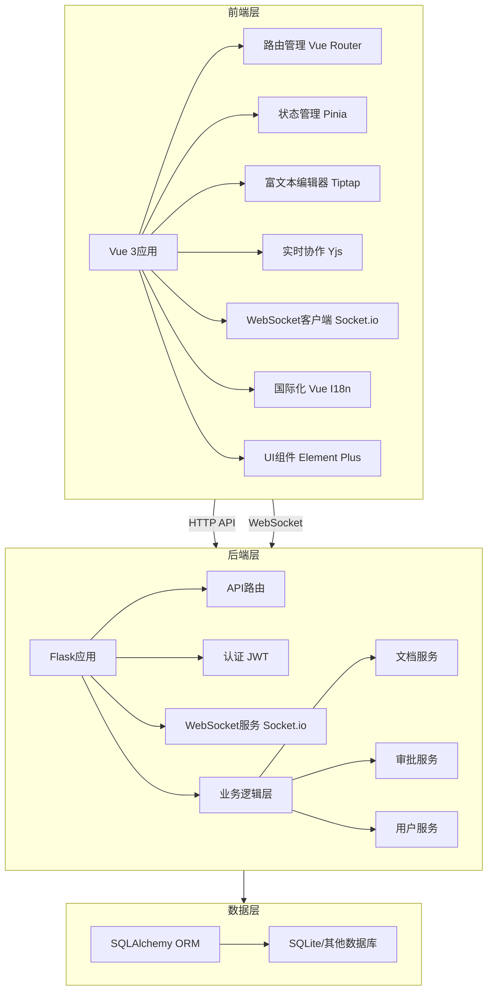
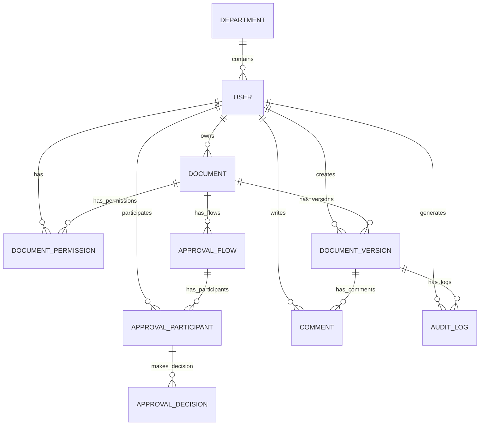

# EDMS 电子文档管理系统 - 技术文档

## 1. 系统概述

EDMS（Electronic Document Management System）是一个现代化的电子文档管理系统，旨在提供高效的文档创建、编辑、协作、审批和管理功能。系统采用前后端分离架构，支持多语言国际化，为企业和组织提供完整的文档生命周期管理解决方案。

### 1.1 核心功能

- **文档管理**：创建、编辑、版本控制、权限管理
- **协作编辑**：实时多人协作编辑，支持光标同步
- **审批工作流**：支持串行和并行审批流程
- **主数据管理**：支持部门、职位、人员等主数据导入
- **评论系统**：文档评论和反馈
- **权限控制**：细粒度的文档权限管理
- **国际化支持**：中英俄三语界面

### 1.2 技术栈

| 分类  | 技术/框架        | 版本       | 用途             |
| --- | ------------ | -------- | -------------- |
| 前端  | Vue 3        | ^3.5.13  | 前端框架           |
| 前端  | TypeScript   | \~5.7.2  | 类型系统           |
| 前端  | Element Plus | ^2.9.1   | UI 组件库         |
| 前端  | Tiptap       | ^2.11.5  | 富文本编辑器         |
| 前端  | Yjs          | ^13.6.23 | 实时协作           |
| 前端  | Socket.io    | ^4.8.1   | WebSocket 通信   |
| 前端  | Vue Router   | ^4.5.0   | 路由管理           |
| 前端  | Pinia        | ^2.3.0   | 状态管理           |
| 前端  | Vue I18n     | ^9.14.2  | 国际化            |
| 后端  | Flask        | -        | 后端框架           |
| 后端  | SQLAlchemy   | -        | ORM            |
| 后端  | JWT          | -        | 身份认证           |
| 后端  | Socket.io    | -        | WebSocket 服务   |
| 数据库 | SQLite       | -        | 默认数据库（支持其他数据库） |
| 部署  | Docker       | -        | 容器化部署          |

## 2. 软件架构

### 2.1 系统架构图



### 2.2 架构说明

- **前端层**：基于Vue 3 + TypeScript构建，使用Element Plus作为UI组件库，Tiptap作为富文本编辑器，Yjs实现实时协作，Socket.io实现WebSocket通信。
- **后端层**：基于Flask框架，提供RESTful API和WebSocket服务，实现文档管理、审批流程、用户管理等核心业务逻辑。
- **数据层**：使用SQLAlchemy作为ORM，默认使用SQLite数据库，支持其他关系型数据库。

系统采用前后端分离架构，通过API和WebSocket进行通信，实现了实时协作编辑、审批工作流等核心功能。

## 3. 数据库结构

### 3.1 数据库表关系图



### 3.2 数据库表结构说明

#### 3.2.1 核心表

**departments (部门表)**

| 字段名  | 数据类型        | 约束                      | 描述   |
| ---- | ----------- | ----------------------- | ---- |
| id   | Integer     | PRIMARY KEY             | 部门ID |
| code | String(64)  | UNIQUE, NOT NULL, INDEX | 部门代码 |
| name | String(256) | NOT NULL                | 部门名称 |

**positions (职位表)**

| 字段名         | 数据类型        | 约束                      | 描述   |
| ----------- | ----------- | ----------------------- | ---- |
| id          | Integer     | PRIMARY KEY             | 职位ID |
| short\_name | String(128) | UNIQUE, NOT NULL, INDEX | 职位简称 |
| full\_name  | String(256) | NOT NULL                | 职位全称 |

**users (用户表)**

| 字段名                   | 数据类型        | 约束                          | 描述     |
| --------------------- | ----------- | --------------------------- | ------ |
| id                    | Integer     | PRIMARY KEY                 | 用户ID   |
| employee\_no          | String(64)  | UNIQUE, NOT NULL, INDEX     | 员工编号   |
| last\_name            | String(128) | NOT NULL                    | 姓氏     |
| first\_name           | String(128) | NOT NULL                    | 名字     |
| patronymic            | String(128) | DEFAULT ""                  | 父名     |
| birth\_date           | Date        | NULL                        | 出生日期   |
| gender                | String(32)  | DEFAULT ""                  | 性别     |
| login\_name           | String(128) | UNIQUE, NOT NULL, INDEX     | 登录名    |
| department\_id        | Integer     | FOREIGN KEY(departments.id) | 部门ID   |
| position\_short       | String(128) | DEFAULT ""                  | 职位简称   |
| manager\_employee\_no | String(64)  | DEFAULT ""                  | 经理员工编号 |
| is\_manager           | Boolean     | DEFAULT False               | 是否为经理  |

#### 3.2.2 文档相关表

**documents (文档表)**

| 字段名                  | 数据类型        | 约束                                 | 描述                                            |
| -------------------- | ----------- | ---------------------------------- | --------------------------------------------- |
| id                   | Integer     | PRIMARY KEY                        | 文档ID                                          |
| owner\_id            | Integer     | FOREIGN KEY(users.id), NOT NULL    | 所有者ID                                         |
| title                | String(512) | NOT NULL, DEFAULT "Untitled"       | 文档标题                                          |
| status               | String(32)  | NOT NULL, DEFAULT "draft"          | 文档状态(draft, in\_approval, approved, rejected) |
| current\_version\_id | Integer     | FOREIGN KEY(document\_versions.id) | 当前版本ID                                        |
| page\_settings\_json | Text        | NULL                               | 页面设置(JSON)                                    |
| created\_at          | DateTime    | DEFAULT utcnow                     | 创建时间                                          |
| updated\_at          | DateTime    | DEFAULT utcnow, onupdate=utcnow    | 更新时间                                          |

**document\_versions (文档版本表)**

| 字段名                 | 数据类型        | 约束                                  | 描述         |
| ------------------- | ----------- | ----------------------------------- | ---------- |
| id                  | Integer     | PRIMARY KEY                         | 版本ID       |
| document\_id        | Integer     | FOREIGN KEY(documents.id), NOT NULL | 文档ID       |
| version\_no         | Integer     | NOT NULL, DEFAULT 1                 | 版本号        |
| content\_json       | Text        | NULL                                | 文档内容(JSON) |
| yjs\_state          | LargeBinary | NULL                                | Yjs状态      |
| created\_by\_id     | Integer     | FOREIGN KEY(users.id)               | 创建者ID      |
| parent\_version\_id | Integer     | FOREIGN KEY(document\_versions.id)  | 父版本ID      |
| created\_at         | DateTime    | DEFAULT utcnow                      | 创建时间       |

**document\_permissions (文档权限表)**

| 字段名          | 数据类型       | 约束                                  | 描述                      |
| ------------ | ---------- | ----------------------------------- | ----------------------- |
| id           | Integer    | PRIMARY KEY                         | 权限ID                    |
| document\_id | Integer    | FOREIGN KEY(documents.id), NOT NULL | 文档ID                    |
| user\_id     | Integer    | FOREIGN KEY(users.id), NOT NULL     | 用户ID                    |
| role         | String(32) | NOT NULL                            | 角色(view, edit, comment) |

#### 3.2.3 审批相关表

**approval\_flows (审批流程表)**

| 字段名            | 数据类型       | 约束                                  | 描述                                |
| -------------- | ---------- | ----------------------------------- | --------------------------------- |
| id             | Integer    | PRIMARY KEY                         | 流程ID                              |
| document\_id   | Integer    | FOREIGN KEY(documents.id), NOT NULL | 文档ID                              |
| flow\_type     | String(32) | NOT NULL                            | 流程类型(parallel, sequential)        |
| status         | String(32) | NOT NULL, DEFAULT "active"          | 流程状态(active, completed, rejected) |
| current\_order | Integer    | DEFAULT 1                           | 当前步骤顺序                            |
| created\_at    | DateTime   | DEFAULT utcnow                      | 创建时间                              |

**approval\_participants (审批参与者表)**

| 字段名         | 数据类型    | 约束                                        | 描述    |
| ----------- | ------- | ----------------------------------------- | ----- |
| id          | Integer | PRIMARY KEY                               | 参与者ID |
| flow\_id    | Integer | FOREIGN KEY(approval\_flows.id), NOT NULL | 流程ID  |
| user\_id    | Integer | FOREIGN KEY(users.id), NOT NULL           | 用户ID  |
| step\_order | Integer | NOT NULL, DEFAULT 1                       | 步骤顺序  |

**approval\_decisions (审批决策表)**

| 字段名             | 数据类型       | 约束                                                       | 描述                  |
| --------------- | ---------- | -------------------------------------------------------- | ------------------- |
| id              | Integer    | PRIMARY KEY                                              | 决策ID                |
| participant\_id | Integer    | FOREIGN KEY(approval\_participants.id), UNIQUE, NOT NULL | 参与者ID               |
| decision        | String(32) | NOT NULL                                                 | 决策(approve, reject) |
| reason          | Text       | NULL                                                     | 决策原因                |
| decided\_at     | DateTime   | DEFAULT utcnow                                           | 决策时间                |

#### 3.2.4 其他表

**comments (评论表)**

| 字段名                   | 数据类型     | 约束                                           | 描述     |
| --------------------- | -------- | -------------------------------------------- | ------ |
| id                    | Integer  | PRIMARY KEY                                  | 评论ID   |
| document\_version\_id | Integer  | FOREIGN KEY(document\_versions.id), NOT NULL | 文档版本ID |
| user\_id              | Integer  | FOREIGN KEY(users.id), NOT NULL              | 用户ID   |
| content               | Text     | NOT NULL                                     | 评论内容   |
| created\_at           | DateTime | DEFAULT utcnow                               | 创建时间   |

**audit\_logs (审计日志表)**

| 字段名                   | 数据类型        | 约束                                 | 描述         |
| --------------------- | ----------- | ---------------------------------- | ---------- |
| id                    | Integer     | PRIMARY KEY                        | 日志ID       |
| document\_version\_id | Integer     | FOREIGN KEY(document\_versions.id) | 文档版本ID     |
| user\_id              | Integer     | FOREIGN KEY(users.id)              | 用户ID       |
| summary               | String(512) | NOT NULL                           | 日志摘要       |
| payload\_json         | Text        | NULL                               | 日志载荷(JSON) |
| created\_at           | DateTime    | DEFAULT utcnow                     | 创建时间       |

## 4. 前端架构和功能模块

### 4.1 前端目录结构

```
frontend/
├── public/              # 静态资源
├── src/
│   ├── api/             # API 客户端
│   ├── components/      # 通用组件
│   ├── composables/     # 组合式函数
│   ├── i18n/            # 国际化配置
│   ├── layouts/         # 布局组件
│   ├── locales/         # 语言文件
│   ├── router/          # 路由配置
│   ├── stores/          # 状态管理
│   ├── utils/           # 工具函数
│   ├── views/           # 页面视图
│   ├── App.vue          # 应用根组件
│   └── main.ts          # 应用入口
├── package.json         # 项目配置
└── vite.config.ts       # Vite 配置
```

### 4.2 前端架构说明

- **组件化设计**：基于Vue 3的组件化架构，将UI拆分为可复用的组件。
- **状态管理**：使用Pinia进行状态管理，管理用户认证、文档状态等。
- **路由管理**：使用Vue Router实现页面路由，支持权限控制。
- **国际化**：使用Vue I18n实现中英文双语支持。
- **实时协作**：使用Yjs和Socket.io实现实时文档协作编辑。
- **富文本编辑**：使用Tiptap富文本编辑器，支持多种编辑功能。

### 4.3 主要功能模块

#### 4.3.1 认证模块

- **登录页面**：用户登录，支持语言切换。
- **权限控制**：基于JWT的身份认证，路由守卫控制访问权限。

#### 4.3.2 文档管理模块

- **文库页面**：显示个人和共享文档，支持状态筛选。
- **文档编辑器**：基于Tiptap的富文本编辑器，支持实时协作。
- **文档版本管理**：查看和比较文档版本历史。
- **文档权限管理**：设置文档的访问权限，支持不同角色（查看、编辑、评论）。

#### 4.3.3 审批工作流模块

- **审批流程配置**：创建串行或并行审批流程，添加审批参与者。
- **审批处理**：审批人查看文档并做出审批决策（批准/拒绝）。
- **审批状态跟踪**：查看审批流程的当前状态和历史记录。

#### 4.3.4 主数据管理模块

- **管理员页面**：上传和导入主数据（部门、职位、人员）。
- **数据验证**：验证导入数据的完整性和正确性。

#### 4.3.5 其他模块

- **收件箱**：查看需要审批的文档。
- **仪表盘**：显示系统统计信息和最近活动。
- **个人中心**：查看个人信息和相关文档。

### 4.4 前端技术亮点

1. **实时协作编辑**：使用Yjs实现冲突-free的实时协作编辑，支持多人同时编辑文档。
2. **响应式设计**：使用Element Plus的响应式组件，适配不同屏幕尺寸。
3. **国际化支持**：内置中英文双语支持，可轻松扩展其他语言。
4. **模块化架构**：清晰的目录结构和模块划分，便于维护和扩展。
5. **类型安全**：使用TypeScript提供类型安全，减少运行时错误。

## 5. 后端架构和功能模块

### 5.1 后端目录结构

```
backend/
├── app/
│   ├── api/             # API 路由
│   ├── models/          # 数据模型
│   ├── services/        # 业务逻辑
│   ├── sockets/         # WebSocket 处理
│   ├── static/          # 静态资源
│   ├── utils/           # 工具函数
│   ├── __init__.py      # 应用初始化
│   ├── config.py        # 配置文件
│   └── extensions.py    # 扩展初始化
├── tests/               # 测试文件
├── requirements.txt     # 依赖文件
└── wsgi.py              # 应用入口
```

### 5.2 后端架构说明

- **分层架构**：采用经典的三层架构，包括API层、服务层和数据访问层。
- **RESTful API**：使用Flask-RESTful实现RESTful API接口。
- **WebSocket服务**：使用Flask-SocketIO实现实时通信。
- **ORM**：使用SQLAlchemy作为ORM，简化数据库操作。
- **认证**：使用JWT进行身份认证和授权。

### 5.3 主要功能模块

#### 5.3.1 认证模块

- **用户登录**：验证用户身份，生成JWT令牌。
- **权限验证**：验证用户是否有权限访问特定资源。

#### 5.3.2 文档管理模块

- **文档CRUD**：创建、读取、更新、删除文档。
- **版本管理**：管理文档的版本历史，支持版本比较。
- **权限管理**：设置和管理文档的访问权限。
- **实时协作**：处理WebSocket连接，同步文档编辑状态。

#### 5.3.3 审批工作流模块

- **流程管理**：创建和管理审批流程。
- **审批处理**：处理审批决策，更新流程状态。
- **通知**：发送审批通知给相关用户。

#### 5.3.4 主数据管理模块

- **数据导入**：导入部门、职位、人员等主数据。
- **数据验证**：验证导入数据的完整性和正确性。
- **数据管理**：管理和维护主数据。

#### 5.3.5 其他模块

- **评论系统**：管理文档评论。
- **审计日志**：记录系统操作日志。
- **导出服务**：导出文档为其他格式。

### 5.4 核心API设计

#### 5.4.1 认证API

- `POST /api/auth/login` - 用户登录
- `GET /api/auth/me` - 获取当前用户信息

#### 5.4.2 文档API

- `GET /api/documents` - 获取文档列表
- `POST /api/documents` - 创建新文档
- `GET /api/documents/:id` - 获取文档详情
- `PATCH /api/documents/:id` - 更新文档信息
- `DELETE /api/documents/:id` - 删除文档
- `GET /api/documents/:id/versions` - 获取文档版本历史
- `GET /api/documents/:id/permissions` - 获取文档权限
- `POST /api/documents/:id/permissions` - 设置文档权限
- `DELETE /api/documents/:id/permissions/:user_id` - 删除文档权限

#### 5.4.3 审批API

- `POST /api/approvals` - 创建审批流程
- `GET /api/approvals/:id` - 获取审批流程详情
- `POST /api/approvals/:id/decisions` - 提交审批决策
- `GET /api/inbox` - 获取用户待审批文档

#### 5.4.4 主数据API

- `POST /api/master-data/import` - 导入主数据
- `GET /api/master-data/departments` - 获取部门列表
- `GET /api/master-data/users` - 获取用户列表

### 5.5 后端技术亮点

1. **实时协作**：使用Socket.io和Yjs实现实时文档协作，支持多人同时编辑。
2. **灵活的审批流程**：支持串行和并行审批流程，满足不同业务场景需求。
3. **细粒度权限控制**：基于角色的权限管理，支持不同级别的文档访问权限。
4. **可扩展性**：模块化设计，便于添加新功能和扩展现有功能。
5. **安全性**：使用JWT进行身份认证，保护API接口安全。

## 6. 输入信息交互算法说明

### 6.1 实时协作编辑算法

#### 6.1.1 Yjs 冲突解决算法

EDMS使用Yjs库实现实时协作编辑，采用CRDT（Conflict-free Replicated Data Type）算法来解决并发编辑冲突。

**核心原理**：

- **操作转换**：将用户的编辑操作转换为可合并的操作，确保最终一致性
- **向量时钟**：使用向量时钟跟踪操作顺序，确保操作的因果关系
- **状态同步**：通过WebSocket实时同步文档状态

**工作流程**：

1. 用户在前端编辑器中进行编辑操作
2. Tiptap编辑器将操作转换为Yjs操作
3. Yjs将操作发送到后端WebSocket服务
4. 后端将操作广播给其他在线用户
5. 其他用户的Yjs实例接收操作并应用到本地文档
6. 所有用户最终看到相同的文档内容

#### 6.1.2 光标同步算法

系统使用Tiptap的collaboration-cursor扩展实现光标同步，让用户能够看到其他用户的编辑位置。

**实现原理**：

- 每个用户的光标位置作为单独的状态在Yjs中管理
- 光标位置更新时通过WebSocket实时广播
- 前端根据接收到的光标位置信息在编辑器中显示其他用户的光标

### 6.2 审批工作流算法

#### 6.2.1 串行审批流程

**算法流程**：

1. 文档创建者启动审批流程，指定审批人及其审批顺序
2. 系统按照指定的顺序依次通知审批人
3. 每个审批人完成审批后，系统自动通知下一个审批人
4. 所有审批人批准后，文档状态变为"已批准"
5. 任何一个审批人拒绝，流程终止，文档状态变为"已拒绝"

**状态管理**：

- 使用`current_order`字段跟踪当前审批步骤
- 只有当前步骤的审批人可以进行审批操作
- 审批决策存储在`approval_decisions`表中

#### 6.2.2 并行审批流程

**算法流程**：

1. 文档创建者启动并行审批流程，指定多个审批人
2. 系统同时通知所有审批人
3. 所有审批人独立进行审批
4. 所有审批人批准后，文档状态变为"已批准"
5. 任何一个审批人拒绝，流程终止，文档状态变为"已拒绝"

**状态管理**：

- 所有审批人同时处于活动状态
- 系统实时跟踪所有审批人的决策状态
- 当所有审批人完成决策或有任何一个拒绝时，流程结束

### 6.3 权限管理算法

**权限检查流程**：

1. 用户请求访问文档时，系统检查用户的权限
2. 权限检查顺序：
   - 检查用户是否为文档所有者
   - 检查用户是否有明确的文档权限
   - 检查文档状态（已批准的文档可能对所有用户可见）

**权限级别**：

- **查看(view)**：只能查看文档内容
- **评论(comment)**：可以查看和评论文档
- **编辑(edit)**：可以查看、编辑和评论文档

### 6.4 主数据导入算法

**导入流程**：

1. 管理员上传Excel文件
2. 系统验证文件格式和数据完整性
3. 系统按照以下顺序导入数据：
   - 部门数据
   - 职位数据
   - 人员数据
   - 管理层关系
4. 导入完成后，系统更新数据库并通知管理员导入结果

**数据验证**：

- 检查必填字段是否为空
- 检查数据格式是否正确
- 检查部门和职位是否存在
- 检查人员编号是否唯一

### 6.5 文档版本管理算法

**版本创建流程**：

1. 用户编辑文档时，系统自动创建新版本
2. 新版本继承父版本的内容和元数据
3. 系统记录版本创建者和创建时间
4. 文档的`current_version_id`更新为新创建的版本ID

**版本比较算法**：

- 系统使用diff算法比较两个版本的内容差异
- 前端使用可视化方式展示版本间的差异
- 用户可以查看任意两个版本之间的差异

### 6.6 搜索算法

**文档搜索流程**：

1. 用户输入搜索关键词
2. 系统在文档标题和内容中搜索匹配项
3. 系统根据匹配度排序并返回结果
4. 前端展示搜索结果，突出显示匹配的关键词

**搜索优化**：

- 使用数据库索引提高搜索性能
- 支持模糊搜索和部分匹配
- 支持按文档状态、创建时间等条件筛选

