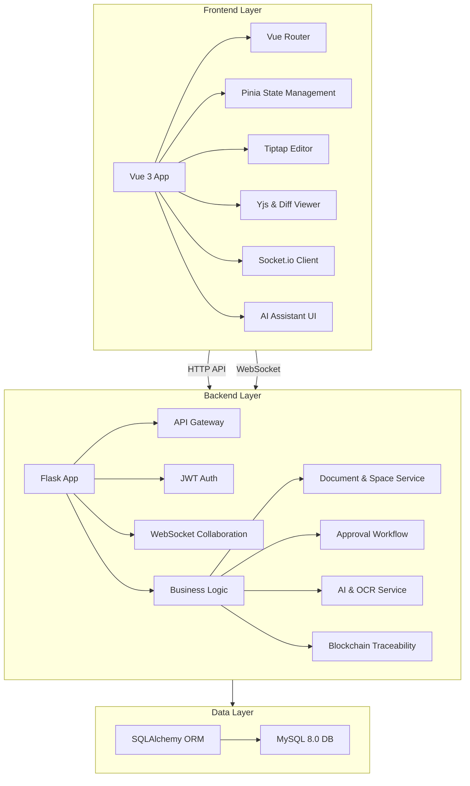
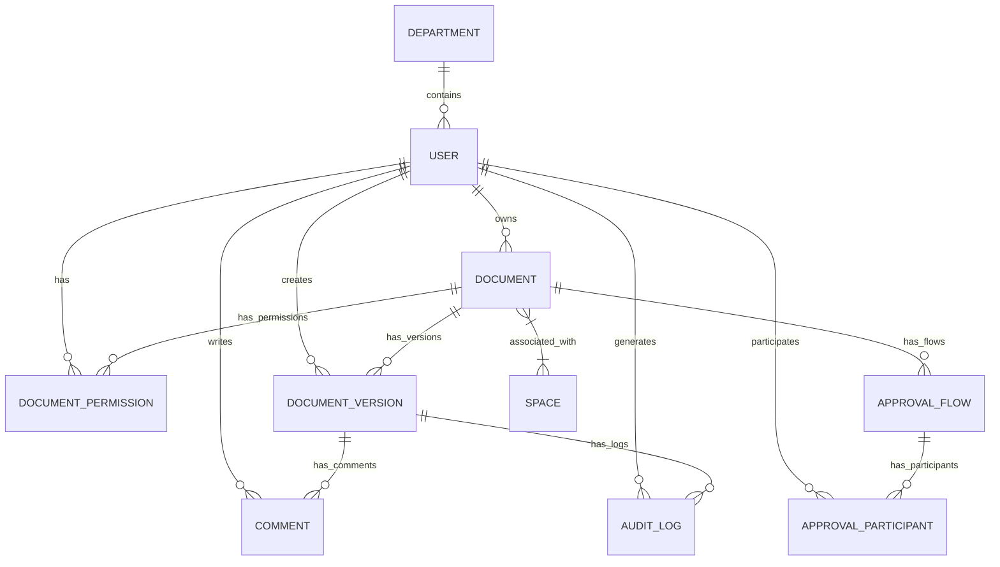

# EDMS - Technical Documentation

## 1. System Overview

EDMS (Electronic Document Management System) is a modern enterprise-grade document management solution designed to provide efficient document creation, editing, collaboration, approval, and management capabilities. The system features a decoupled architecture with **MySQL 8.0+** as the core data store. It integrates AI assistance and blockchain-based traceability to offer a complete document lifecycle and digital asset protection solution.

### 1.1 Core Features

- **Multi-Space Categorization**: Documents can be associated with multiple "Knowledge Spaces" (Many-to-Many), breaking traditional hierarchical limits.
- **Collaborative Editing & Diff**: CRDT-based real-time multi-user editing and side-by-side visual difference comparison of historical versions.
- **Approval Workflows**: Supports serial and parallel approval processes with full status transition logs.
- **Master Data Management**: Import for departments, positions, and employees.
- **AI-Powered Assistance**: Conversational document generation and intelligent layout via image OCR.
- **Tamper-Proof Traceability**: SHA-256 hashing for approved documents with evidence logged in a Mock Blockchain.
- **Internationalization**: Seamless interface switching between English, Chinese, and Russian.

### 1.2 Technology Stack

| Category | Technology / Framework | Version | Usage |
| :--- | :--- | :--- | :--- |
| Frontend | Vue 3 | ^3.5.13 | Core Framework |
| Frontend | TypeScript | ~5.7.2 | Type System |
| Frontend | Element Plus | ^2.9.1 | UI Component Library |
| Frontend | Tiptap | ^2.11.5 | Rich Text Editor |
| Frontend | Yjs | ^13.6.23 | Real-time Collaboration (CRDT) |
| Frontend | Socket.io | ^4.8.1 | WebSocket Communication |
| Backend | Flask | - | Backend API Framework |
| Backend | SQLAlchemy | - | ORM Mapping |
| Database | **MySQL** | **8.0+** | **Core Relational Database** |
| Deployment | Docker | - | Containerization |

---

## 2. Software Architecture

### 2.1 Architecture Diagram

---

## 3. Database Structure

### 3.1 Entity Relationship Diagram (ERD)

### 3.2 Core Table Definitions
*Note: All tables use `utf8mb4` encoding to handle rich text and special characters.*

#### spaces (Knowledge Spaces)
| Field | Type | Constraint | Description |
| :--- | :--- | :--- | :--- |
| id | Integer | PRIMARY KEY | Space ID |
| name | String(256) | NOT NULL | Space Name |
| description | Text | NULL | Space Description |

#### document_spaces (M2M Junction)
| Field | Type | Constraint | Description |
| :--- | :--- | :--- | :--- |
| document_id | Integer | FOREIGN KEY | Document ID |
| space_id | Integer | FOREIGN KEY | Space ID |

#### documents
| Field | Type | Constraint | Description |
| :--- | :--- | :--- | :--- |
| id | Integer | PRIMARY KEY | Document ID |
| owner_id | Integer | FOREIGN KEY | Owner ID |
| title | String(512) | NOT NULL | Document Title |
| status | String(32) | NOT NULL | Status (draft/approved, etc.) |
| current_version_id | Integer | FOREIGN KEY | Current active version ID |

---

## 4. Core Algorithms

### 4.1 Real-time Collaboration (Yjs CRDT)
The system uses Yjs for lock-free collaborative editing.
- **Conflict Resolution**: Uses CRDT (Conflict-free Replicated Data Types) to ensure consistent merging across all terminals.
- **State Sync**: Binary Update fragments are broadcasted via WebSocket.
- **Awareness**: Real-time cursor sharing and online status tracking via the Awareness module.

### 4.2 Version Diffing
Based on the `diff-match-patch` algorithm:
- **Backend Processing**: Extracts text streams from two versions.
- **Diff Generation**: Calculates minimum edit distance to generate segments (INSERT, DELETE, EQUAL).
- **Frontend Rendering**: Highlights additions in green and deletions in red with strikethroughs.

### 4.3 Blockchain Traceability
- **Trigger**: Automatically executes when document status becomes `approved`.
- **Hashing**: SHA-256 fingerprint generation for title, content, and metadata.
- **Logging**: Writes the fingerprint into a Mock Blockchain ledger for future integrity audits.

### 4.4 AI & OCR Processing
- **AI Generation**: Calls LLM APIs and streams markdown content directly into the Tiptap editor.
- **Image-to-Doc**: OCR extracts text and structure from images, which AI then reconstructs into standard document layouts.
