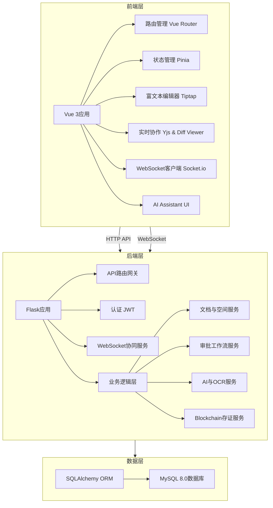
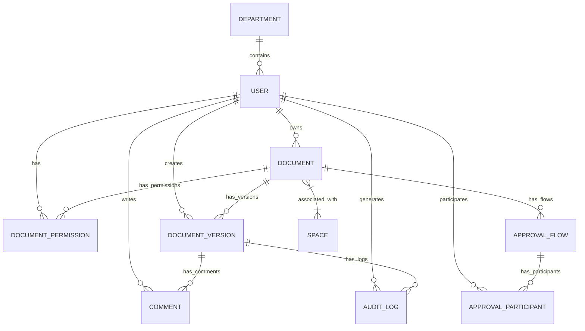

# EDMS 电子文档管理系统 - 技术文档

## 1. 系统概述

EDMS（Electronic Document Management System）是一个现代化的企业级电子文档管理系统，旨在提供高效的文档创建、编辑、协作、审批和管理功能。系统采用前后端分离架构，核心数据基于 **MySQL 8.0+** 存储，并集成了 AI 智能辅助与区块链溯源技术，为企业提供完整的文档生命周期与数字资产保护解决方案。

### 1.1 核心功能

- **文档管理与多空间分类**：支持文档与空间的“多对多”关联，打破传统层级限制。
- **协作编辑与 Diff 比对**：基于 CRDT 的实时多人协作编辑，以及历史版本的双向可视化差异比对。
- **审批工作流**：支持串行和并行审批流程，完整记录状态流转。
- **主数据管理**：支持部门、职位、人员等基础数据导入。
- **AI 智能辅助**：对话式文档生成与图片 OCR 智能排版。
- **防篡改溯源**：对已批准文档进行哈希计算，并使用 Mock 区块链技术存证记录。
- **国际化支持**：中、英、俄多语种界面无缝切换。

### 1.2 技术栈

| 分类 | 技术/框架 | 版本 | 用途 |
| :--- | :--- | :--- | :--- |
| 前端 | Vue 3 | ^3.5.13 | 前端框架 |
| 前端 | TypeScript | ~5.7.2 | 类型系统 |
| 前端 | Element Plus | ^2.9.1 | UI 组件库 |
| 前端 | Tiptap | ^2.11.5 | 富文本编辑器 |
| 前端 | Yjs | ^13.6.23 | 实时协作 (CRDT) |
| 前端 | Socket.io | ^4.8.1 | WebSocket 通信 |
| 后端 | Flask | - | 后端 API 框架 |
| 后端 | SQLAlchemy | - | ORM 映射 |
| 数据库 | **MySQL** | **8.0+** | **核心关系型数据库** |
| 部署 | Docker | - | 容器化部署 |

---

## 2. 软件架构

### 2.1 系统架构图

---

## 3. 数据库结构

### 3.1 数据库表关系图

### 3.2 重点表结构说明
*注意：所有表默认采用 `utf8mb4` 字符集以兼容富文本。*

#### spaces (知识空间表)
| 字段名 | 数据类型 | 约束 | 描述 |
| :--- | :--- | :--- | :--- |
| id | Integer | PRIMARY KEY | 空间ID |
| name | String(256) | NOT NULL | 空间名称 |
| description | Text | NULL | 空间描述 |

#### document_spaces (多对多关联表)
| 字段名 | 数据类型 | 约束 | 描述 |
| :--- | :--- | :--- | :--- |
| document_id | Integer | FOREIGN KEY | 文档ID |
| space_id | Integer | FOREIGN KEY | 空间ID |

#### documents (文档表)
| 字段名 | 数据类型 | 约束 | 描述 |
| :--- | :--- | :--- | :--- |
| id | Integer | PRIMARY KEY | 文档ID |
| owner_id | Integer | FOREIGN KEY | 所有者ID |
| title | String(512) | NOT NULL | 文档标题 |
| status | String(32) | NOT NULL | 文档状态 (draft/approved等) |
| current_version_id | Integer | FOREIGN KEY | 当前显示版本ID |

---

## 4. 核心算法说明

### 4.1 实时协作与 Yjs CRDT 算法
系统使用 Yjs 实现无锁协同编辑。
- **并发冲突**：采用 CRDT（无冲突复制数据类型）算法，确保不同终端的操作最终能够合并出一致的结果。
- **状态同步**：通过 WebSocket 广播二进制 Update 片段。
- **感知层**：利用 Awareness 模块实时共享用户光标与在线状态。

### 4.2 历史版本差异比对 (Diff)
基于 `diff-match-patch` 算法：
- **后端计算**：提取两个版本的文本流。
- **差异生成**：计算最小编辑距离，生成包含 INSERT(1), DELETE(-1), EQUAL(0) 的段落数组。
- **前端渲染**：绿色高亮新增内容，红色删除线标记移除内容。

### 4.3 区块链防篡改存证
- **触发机制**：当文档状态变为 `approved` 时自动触发。
- **哈希计算**：对标题、内容及元数据使用 **SHA-256** 生成唯一指纹。
- **存证写入**：将指纹写入区块链账本，确保审计时可验证原始数据是否被篡改。

### 4.4 AI 生成与 OCR 处理
- **内容生成**：后端调用 LLM 接口，流式返回(Stream) markdown 内容并注入 Tiptap。
- **图生文**：上传图片经 OCR 提取文本后，由 AI 结合上下文重构为标准文档结构。
